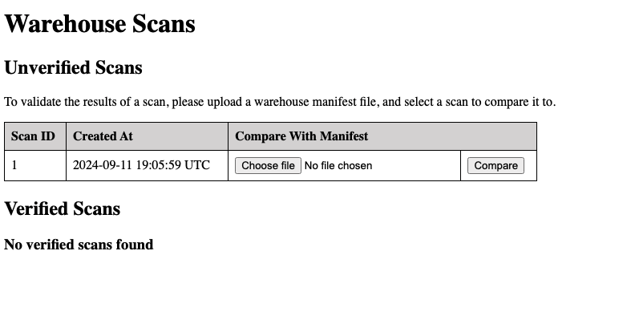

# Usage Instructions

## Basic Usage

To use the application, open your web browser and navigate to the following url:
```
http://localhost:3000
```
You will see the initial warehouse inventory screen:


In order to use the application, some scan data needs to be uploaded from our robots. For more information about importing scan data, please see the [Uploading Warehouse Scans](./uploading_warehouse_scan_records.md) documentation.

## Verifying Scans
Once you have at least one scan uploaded, the warehouse inventory screen will look like this:


You can now verify the contents against an expected warehouse contents manifest by uploading a CSV file and clicking "compare".

The verification will be performed in the background, and the page will update automatically update when the report has been processed:


## Viewing Verification Report
To see the results of a verification report, click on the "See Comparison Report" link. This will take you to the report contents:


## Export As CSV
To download a CSV copy of the report, click on "Export as CSV". You can see an example of the generated report here: [Example Report](../samples/comparison_report.csv).
